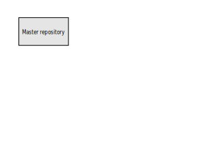

# How to develop and share content

## Developing
This chapter explains howto develop content. All content is developed and maintained using Git and GitHUb.

## Sharing
This chapter explains howto share content. All content is shared on  Azure(http://agilearchitect.azurewebsites.net/)

### For offline and mobile reading
PDF, Kindle and Epub will be created and an URL for download will be available from this site.

### For browsing
This URL

Below is an illustration showing the workflow:

