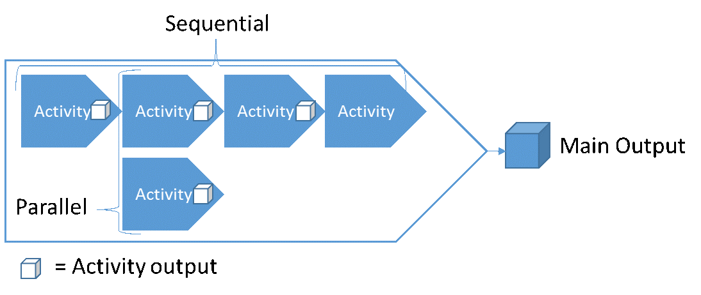
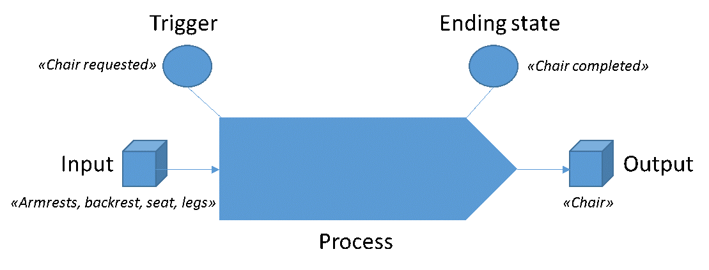
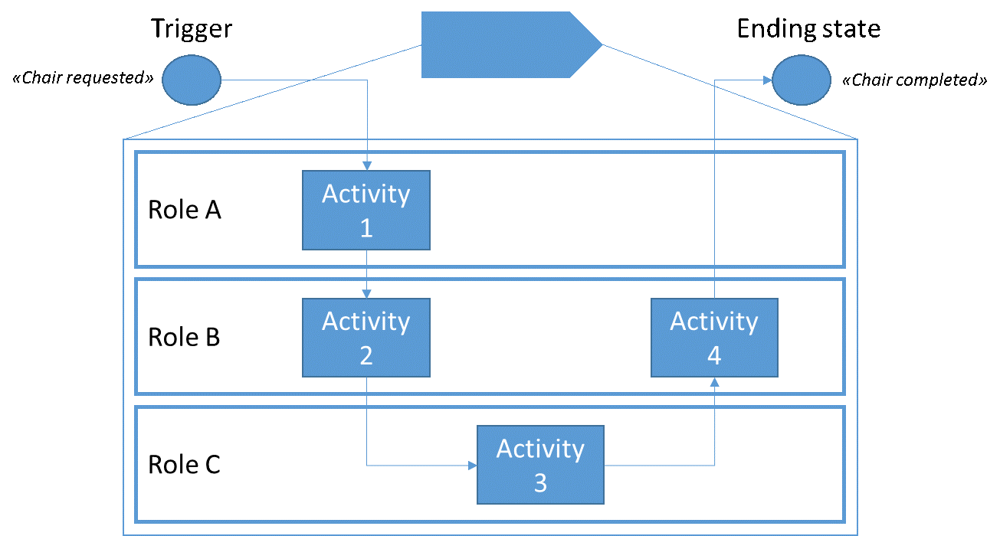
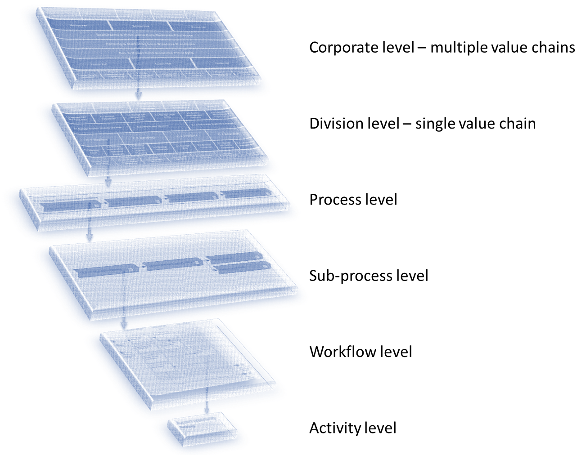
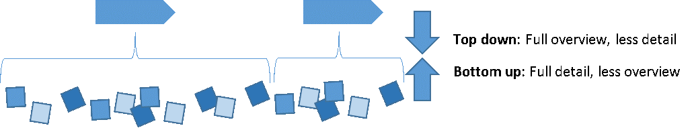
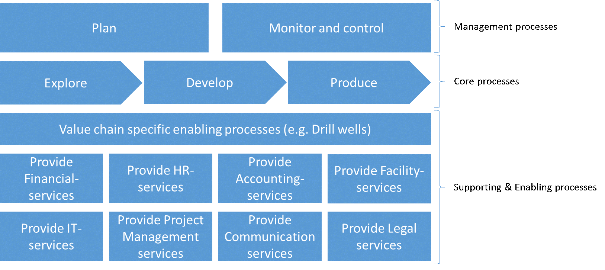
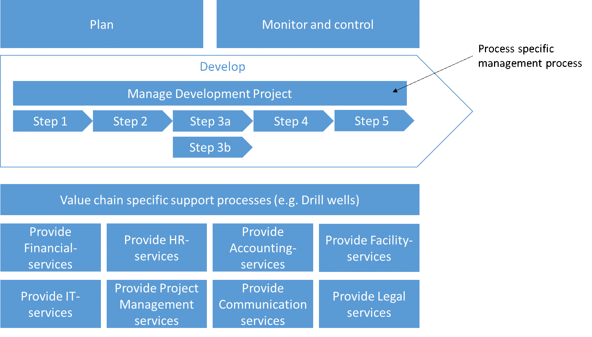

# How to build the Process Architecture

## Basic Principles of Process Architecture

### Process definition
The basic definition of a process are the activities that transform input into output. The definition can be expanded, but for our purpose, this basic definition is sufficient. All processes have a main output, but can also have secondary outputs. The main output is the reason the process exist, and its name is often reflected in the name of the process itself. For example the “Hire employee” process has a name that corresponds to its main output which is to produce a new employee.  Secondary outputs may be additional outputs like a report, a receipt, and similar. All activities produce some output, but not all of them are directed towards achieving the main output of the process as a whole.

### Output focus
Focus on the output is of crucial importance for correct scoping and framing of a process. It helps us to include the activities, inputs and other variables that must be present to produce the outputs, and it help us to exclude those that doesn’t.

Outputs are primarily produced and refined in one of two ways; construction or state change. Construction means that the output is created by putting together, assemble or otherwise merge parts into a new whole. For example building a chair from parts of armrests, backrest, seat, etc. State change means that the output in large has the same form, but go through different states of completion, approval, refinement etc. An example may be a plan that from the first process is in state “draft”, and after the second process is in state “final draft”, and after the third process is in state “completed”. A generic name for input and output objects are Business Objects.

### Process structure
By definition, a process are those activities that transform inputs into an output, for one instance of such value creation. This is true from the most granular level, a specific activity, to the most abstract level, an entire value chain. Structurally, in relation to each other, the parts of a process can only be sequential or parallel towards producing the main output. The structure is not concerned with triggers or time other than steps being sequential or parallel.

### Start & End
The start and end of a process are marked by states. The start state is often referred to as trigger, and the end is often referred to as end state. States are not the same as inputs and outputs. States are points in time where certain things are true and/or false, while inputs and outputs are things.

A trigger can be automatic or manual, but always contains some criteria. Typical criteria are related to time, inputs and aspects of these inputs. Three example trigger states are “Order received”, “Time to initiate planning”, and “Chair requested”. Examples of ending states are “Chair completed”, “Package delivered”, or “Plan finished”. Because of the similarities in naming between states and input / output, these concepts are often confused. As the purpose of a process is to use some input to produce some output, it is natural that the state names reflect this.

### Roles, Responsibility and link to departments
At some level of detail, it is natural to visualize responsibility for activities, and such an illustration is referred to as a workflow diagram. This is often reserved for the most granular level of modeling because when processes are at  higher levels of abstraction they often span multiple departments / functions of a company. The entity responsible for performing an activity in a process is called a role. Like in a play, a role can be filled by multiple actors. The actors in this case are positions that belong to departments. Positions are filled by people. Such diagrams only visualize actual actions, and as such the roles that are set to perform activities are those who actually perform it, and are not just accountable.

## Levels and types of processes in the Process Architecture
### Levels of abstraction
A process can be decomposed to reveal its underlying details, which are sub-processes. This decomposition can be done multiple times over, from a very abstract level of process to an extremely detailed level of process. The basic principles of process applies at all levels of abstraction.

What number of levels is appropriate? That varies depending on factors such as cost/benefit, complexity of a given area, the amount of work, the problem to solve, and desire to standardize. What is a level? A level should be counted as number of breakdowns, and the first level is 0. As an example, due to the amount and complexity of the work, it is natural that the “develop” process of an oil & gas exploration and production value chain is deeper than the “hire employee” process of a “Provide HR-services” process area.

A rule of tumb is that most process architectures have from 3-5 levels, where most of processes only need 3 levels to reach the detail level suitable for using workflow diagrams. Larger corporations with multiple value chains might require more levels of the architecture is decided to encompass the whole corporation and not to be made for each division / value chain.

NB: Even dough we give processes different names depending on level of abstraction, like call it a sub-process or activity, they all mean the same thing and adhere to the same basic rules.

The following is another example of a normal breakdown:

### Top down & bottom up discovery and mapping
It is possible to approach process architecture from a top down or bottom up approach. Top down means to begin at a high and abstract level to be able to capture the full with of the company’s processes, and then in the next step start to decompose to more detail. Bottom up means to begin at a detailed and concrete level, and then proceed to aggregate multiple detailed activities into processes.

The bottom up approach is prone to duplications and overlaps due to often missing the big picture. It is only natural such problems increase in likelihood when working at a very high level of detail. The top down approach can be criticized of portraying things too simplified, as management want it to be, and not as they really are. The solution to avoid these problems are to start top down, but as processes are decomposed to quickly involve stakeholders that know the intricate details of work really gets done.

### Management-, core-, and enabling processes
When looking at all the steps required to produce outputs, one often naturally exclude several activities which actually contribute. What are included are most often those activities that directly contribute to the production or refinement of the product. Activities that are often excluded are those that provide things that enable the production, and those that provide rules, guidance and control for the production. An example; when listing activities needed to produce a cake, would you include those activities which are needed to provide you with an oven, electricity, or flour? What about those activities which provide rules on type of cake, or how you and your friend should divide responsibility between yourself?

Activities that directly contribute to the value creation are labeled core processes. Those that provide guidance, rules, constraints and control are labeled management processes. Those that enable or support the value creation indirectly are called enabling / supporting processes. BPTrends sum this nicely up in the IGOE model, which stands for Inputs, Guides, Outputs and Enablers.

When looking at the top level of the process architecture, we can use the same logic to divide work into these groups based on how they contribute to the value creation. Management processes are those which plan and control, core processes those which directly contribute to producing the products of the company, and supporting / enabling processes are all the other processes which indirectly contribute to value creation.

This logic also follows the scientific PDCA method, in that for one turn of value creation, the management processes on the top level provide the Plan, Check and Act steps, while the rest are the Do step.

### Supporting vs Enabling processes
There is no definite standard established on whether to use supporting processes or enabling processes. However, several companies have differentiated their use by saying that supporting process are more general service areas supporting the whole company, while enabling processes are value chain specific. An example might be how “drill well” is a value chain specific enabling process being called upon multiple times during one round of value creation. Another example from a hospital might be the enabling process “analyze blood samples”, which may be called upon multiple times during the value chain of treating a patient.

### Management processes
There are several ways of looking at management processes. The “losest” approach is one where companies bundle together all processes management are involved in. Another approach is trying to focus more exclusively on those management processes which provide guides and constraints for other processes. Finally, one approach focus on management processes as being the Plan, Check & Act from PDCA. These approaches are not mutually exclusive and are in practice combined.

### Management- & Supporting processes across levels
Should we only have management and supporting processes divided on the top level? Once more, several different approaches exist. One approach is to say that all process areas find their management processes in the shared area on the top level. For example, that yearly planning is a shared process that to which all management must adhere. Another approach is to say that when decomposing a process, the top level management and supporting processes are inherited down, but another process specific layer of management and/or supporting processes are introduced as needed.

An example of this may be that a core process called “develop”, in which an oil & gas company develops an oilfield to make it ready for production. In addition to the management processes that are shared by the entire value chain, there exist some process specific management process in terms of project management. 
