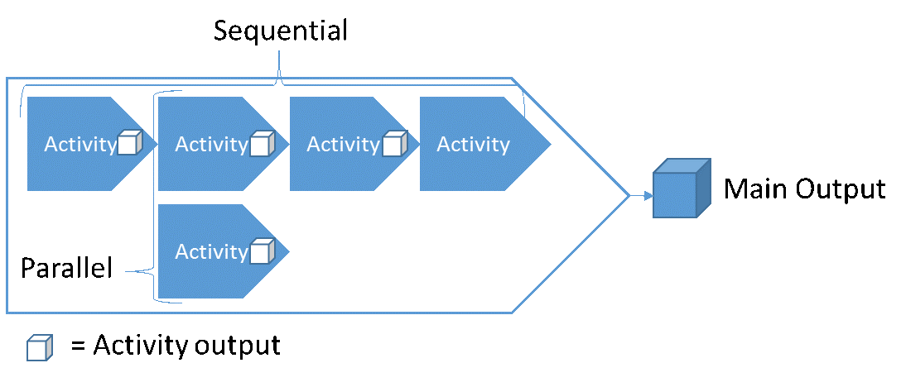
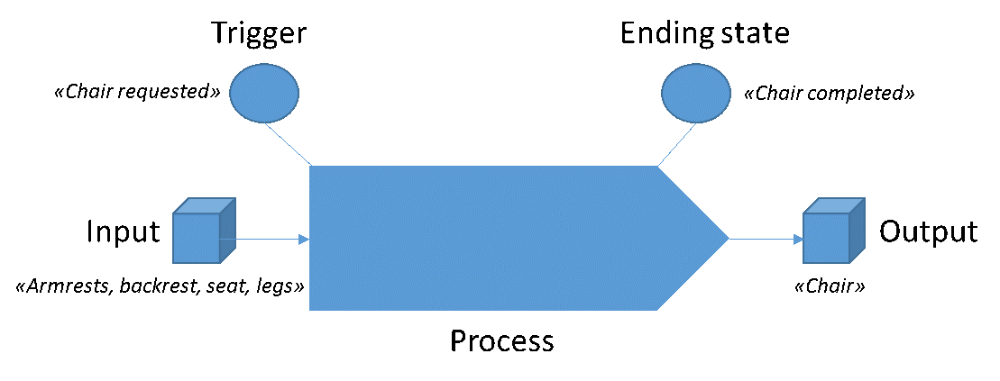

[comment]: language=en
# What is Business Architecture?

Business Architecture consists of principles, methods and tools for the design and management of how the organization satisfies relevant stakeholders. In many ways, it can be seen as a concretization of the more tangible aspects of management. Compared to traditional building architecture that is often relatively static once built, Business Architecture has more focus on aspects of management and change as organizations are always evolving.

The purpose of Business Architecture is understanding, improving and shaping our work to satisfy stakeholders. The Architecture is created from making our business insight explicit in the form of models that describe our understanding. These models then create a platform for shared understanding, transparency and thus exponentially increased insights-generation, which again shape both real life and updated models. This platform enables better implementation and execution of strategy, as well as better strategic decision making from better information. Decisions influence structure, and structure influence decisions.

The main concepts in a Business Architecture are, but not limited to, stakeholders, inputs, outputs, processes, departments, positions, people, goals and objectives. Organizations must satisfy stakeholders to survive and thrive. To do this, they must provide outputs that are of value to the stakeholders, and they must handle inputs received from stakeholders.

All outputs are created from processes, and all inputs are handled by processes. Processes are our work. In processes, the work-activities are performed by roles. Roles are filled by positions, which in turn are filled by people. Positions and people belong to departments. Goals and objectives specify targets for different aspects of our relationships with stakeholders, input-output transactions, and process performance.

The perhaps most central concept within Business Architecture is Process Architecture. This is because work-activities are what produces outputs of value. All other elements of an organization exist to support, steer or in some way or another influence work. Business processes therefore become the red thread of alignment through the complex cloud that is the modern organization. Why do we have people? To perform work. Why do we have a rules, goals and objectives? To steer work. Why do we have IT-applications, machines or facilities? To support work and enable work. The study of processes is the study of how we work to achieve outputs and outcomes of value. If we want to align all the aspects of our organization, we must first understand our processes and their output.

# Clarification of central concepts
Working with Enterprise and Business Architecture involves defining and relating concepts to each other. This must be done on a “platform” or “dictionary” level (called conceptual metamodel), before one can go ahead and model the actual architecture. An analogy is that the engineers and building architect must agree on what words mean before they start creating the blueprints.

Concepts: Wikipedia: “Concepts are something conceived in the mind, and an abstract idea representing the fundamental characteristics of what it represents. Concepts arise as abstractions or generalizations from experience or the result of a transformation of existing ideas. In the simplest terms, a concept is a name or label that regards or treats an abstraction as if it had concrete or material existence, such as a person, a place, or a thing. It may represent a natural object that exists in the real world like a tree, an animal, a stone, etc. It may also name an artificial (man-made) object like a chair, computer, house, etc. Concepts are created (named) to describe, explain and capture reality as it is known and understood.”

Core concepts must be named / labeled and explained in the conceptual metamodel. For example, what is meant by a function? We have this label / name called function, but it must be further clarified what it is, what attributes and relations it has to other concepts.

Example: Conceptual Metamodel for Process oriented Business Architecture

Each concept can be defined further textually (dictionaries) and in separate models that detail important aspects of that particular concept.

**Much discussed concepts: Process, functions, capabilities, departments**
There exist a lot of discussion and confusion about the concepts process, capability, function and department. A conceptual metamodel can help to clarify the discussion.

**First, an activity** is a higher conceptual class of action than process. Activity simply is doing something, action.

**A process** on the other hand is any activity that transform input to output that has value for someone. Process specifically structures activities according to sequential and parallel value creation.

**A function is** the purpose of something. (E.g. the function of the veins is to carry blood to the heart. Cambridge dictionary). One of the things purpose is used for is to group things, for example activities or people. However, the concept of function offers no internal structure among the elements. To the extent the purpose of something is to transform input into output of value for someone, the concept of process must be used to answer “how”. If the function is something else, then the concept of process is not involved in answering “how”. In both programming and business there is extensive and different misuse of these concepts. In programming, function is often defined similarly as process. In business, function is often thought of being the same as department.

**Departments are** divisions of an organization by which people and resources are grouped and managed. Departmentalization may have different dividing principles, some of which are functional, geographical, product, project or process. Departments can be created and named by their functions (purpose). In such a case, the function is usually at a very abstract level; e.g. the function if this department is “Accounting”.

**Capability** is simply the state of being capable of something. Such a state becomes true by having a recipe of how to do something (process) and having the resources to perform the process. Resources includes people, money, machines, time, etc.

**Abstraction levels**  are a major reason for confusion. All concepts mentioned can be used from very abstract to very concrete levels. For example, a function at a very high level might be that the function of our company is to provide customers with electric cars. At a very concrete level a person might have the function of mounting steering wheels. A process at very high level might be “Provide electric car”, and a very concrete process might be “Mount steering wheel”. Do we have the capability to mount a steering wheel? Well, at least we have a process for it, and a person to perform it, but do we have the other materials? The point is that all these concepts are discrete concepts, and not more or less abstract in relation to each other. Put another way, capability cannot be broken down into functions, which cannot be broken down into processes. Their relations are not of decomposition. They can however be decomposed into more details of the same concept.

# Why build a process oriented business architecture and what problems can you solve?

There are both general and specific answers to this. First let’s address some general answers on the level of principles. Then, we will look at specific problems that can be solved.

**1. Why study work?**
At the principal level, we can rephrase the question of “why build a process architecture” to “why study work”. Framed in this wording, multiple reasons come to mind.

Humans, animals, machines and software can perform work. Work is action with a purpose, and from physics we know that it is only through action that anything can be changed or achieved. This is perhaps as obvious as it is profound, but it is the main reason why studying work is relevant for all goals and future states a company want to achieve or obtain.

When working to achieve something, humans often rely on other humans and technology. This is especially true in organization as the objectives they are seeking to achieve are too large in scope, volume or complexity for any one person to solve. Large numbers of people working together, using technology, resources, and adhering to rules and constraints, generates a complex system. The task of coordinating and optimizing this system of value creation is a demanding task, and becomes increasingly so given ever higher speed of change.

However, as complexity increases, we must not lose focus on the fact that work is what creates action towards some goal, and work consist of activities / processes. From this property, all organizational complexity can be simplified, understood and handled by relating it to specific processes with their specific outputs and objectives. For example, a rule, document, machine, application, competency, security or risk barrier, facility, piece of information and even a human, only exist to support, steer or enable some work process to produce its output.

Finally, a process and a process model is not the same thing. All processes exist regardless of having been documented or not. If not documented, there is a high probability that they have lots of variation. Documentation of processes in the form of graphic models and text is a requirement to conduct systematic analysis and improvement.

The bottom line is that all organization, coordination, analysis and improvement of an organization and its value creation must be related to its work processes. If not, the organization, coordination, analysis and improvement is not systematic and scientific enough and thus prone to sub optimization and guesswork.

**2. Specific problems that can be solved**
We have now established that any problem in an organization should be related to work processes in order to be systematically understood and solved. Problems can be on a very abstract level or a very detailed level. To make this less abstract, here follows a (not exhaustive) list of problems in which process analysis and improvement makes up a large part:

- Problems with collaboration, coordination and responsibilities
- Problems with product quality, cost and timeliness (of all kinds, not only to final customer)
- Problems with customer handling and satisfaction (customer journeys)
- Problems with suppliers, coordination and logistics
- Problems with compliance, risk and regulations
- Problems with efficiency and effectiveness
- Problems with change
- Problems with IT-system requirements and specifications
- Problems with documentation, training and competency
- Problems with risk and security
- Problems with operationalization of strategy
- Problems with planning, execution, monitoring and corrective actions

In later parts, we will look at certain problems and how to solve them in more detail. It is also worth to mention that it is not a coincidence or “hype” that these problems span most of what an organization does and goes across all organizational divides. It simply follows from the properties of the concept known as process.

# How to build the Process Architecture
## Basic Principles of Process Architecture
### Process definition:
The basic definition of a process are the activities that transform input into output. The definition can be expanded, but for our purpose, this basic definition is sufficient. All processes have a main output, but can also have secondary outputs. The main output is the reason the process exist, and its name is often reflected in the name of the process itself. For example the “Hire employee” process has a name that corresponds to its main output which is to produce a new employee.  Secondary outputs may be additional outputs like a report, a receipt, and similar. All activities produce some output, but not all of them are directed towards achieving the main output of the process as a whole.

### Output focus
Focus on the output is of crucial importance for correct scoping and framing of a process. It helps us to include the activities, inputs and other variables that must be present to produce the outputs, and it help us to exclude those that doesn’t.
Outputs are primarily produced and refined in one of two ways; construction or state change. Construction means that the output is created by putting together, assemble or otherwise merge parts into a new whole. For example building a chair from parts of armrests, backrest, seat, etc. State change means that the output in large has the same form, but go through different states of completion, approval, refinement etc. An example may be a plan that from the first process is in state “draft”, and after the second process is in state “final draft”, and after the third process is in state “completed”. A generic name for input and output objects are Business Objects.

### Process structure
By definition, a process are those activities that transform inputs into an output, for one instance of such value creation. This is true from the most granular level, a specific activity, to the most abstract level, an entire value chain. Structurally, in relation to each other, the parts of a process can only be sequential or parallel towards producing the main output. The structure is not concerned with triggers or time other than steps being sequential or parallel.

### Start & End
The start and end of a process are marked by states. The start state is often referred to as trigger, and the end is often referred to as end state. States are not the same as inputs and outputs. States are points in time where certain things are true and/or false, while inputs and outputs are things.

A trigger can be automatic or manual, but always contains some criteria. Typical criteria are related to time, inputs and aspects of these inputs. Three example trigger states are “Order received”, “Time to initiate planning”, and “Chair requested”. Examples of ending states are “Chair completed”, “Package delivered”, or “Plan finished”. Because of the similarities in naming between states and input / output, these concepts are often confused. As the purpose of a process is to use some input to produce some output, it is natural that the state names reflect this.

### Roles, Responsibility and link to departments
At some level of detail, it is natural to visualize responsibility for activities, and such an illustration is referred to as a workflow diagram. This is often reserved for the most granular level of modeling because when processes are at  higher levels of abstraction they often span multiple departments / functions of a company. The entity responsible for performing an activity in a process is called a role. Like in a play, a role can be filled by multiple actors. The actors in this case are positions that belong to departments. Positions are filled by people. Such diagrams only visualize actual actions, and as such the roles that are set to perform activities are those who actually perform it, and are not just accountable.

## Levels and types of processes in the Process Architecture
### Levels of abstraction
A process can be decomposed to reveal its underlying details, which are sub-processes. This decomposition can be done multiple times over, from a very abstract level of process to an extremely detailed level of process. The basic principles of process applies at all levels of abstraction.
What number of levels is appropriate? That varies depending on factors such as cost/benefit, complexity of a given area, the amount of work, the problem to solve, and desire to standardize. What is a level? A level should be counted as number of breakdowns, and the first level is 0. As an example, due to the amount and complexity of the work, it is natural that the “develop” process of an oil & gas exploration and production value chain is deeper than the “hire employee” process of a “Provide HR-services” process area.

A rule of tumb is that most process architectures have from 3-5 levels, where most of processes only need 3 levels to reach the detail level suitable for using workflow diagrams. Larger corporations with multiple value chains might require more levels of the architecture is decided to encompass the whole corporation and not to be made for each division / value chain.

NB: Even dough we give processes different names depending on level of abstraction, like call it a sub-process or activity, they all mean the same thing and adhere to the same basic rules.

The following is another example of a normal breakdown:

### Top down & bottom up discovery and mapping
It is possible to approach process architecture from a top down or bottom up approach. Top down means to begin at a high and abstract level to be able to capture the full with of the company’s processes, and then in the next step start to decompose to more detail. Bottom up means to begin at a detailed and concrete level, and then proceed to aggregate multiple detailed activities into processes.

The bottom up approach is prone to duplications and overlaps due to often missing the big picture. It is only natural such problems increase in likelihood when working at a very high level of detail. The top down approach can be criticized of portraying things too simplified, as management want it to be, and not as they really are. The solution to avoid these problems are to start top down, but as processes are decomposed to quickly involve stakeholders that know the intricate details of work really gets done.

### Management-, core-, and enabling processes
When looking at all the steps required to produce outputs, one often naturally exclude several activities which actually contribute. What are included are most often those activities that directly contribute to the production or refinement of the product. Activities that are often excluded are those that provide things that enable the production, and those that provide rules, guidance and control for the production. An example; when listing activities needed to produce a cake, would you include those activities which are needed to provide you with an oven, electricity, or flour? What about those activities which provide rules on type of cake, or how you and your friend should divide responsibility between yourself?

Activities that directly contribute to the value creation are labeled core processes. Those that provide guidance, rules, constraints and control are labeled management processes. Those that enable or support the value creation indirectly are called enabling / supporting processes. BPTrends sum this nicely up in the IGOE model, which stands for Inputs, Guides, Outputs and Enablers.

When looking at the top level of the process architecture, we can use the same logic to divide work into these groups based on how they contribute to the value creation. Management processes are those which plan and control, core processes those which directly contribute to producing the products of the company, and supporting / enabling processes are all the other processes which indirectly contribute to value creation.

This logic also follows the scientific PDCA method, in that for one turn of value creation, the management processes on the top level provide the Plan, Check and Act steps, while the rest are the Do step.

### Supporting vs Enabling processes
There is no definite standard established on whether to use supporting processes or enabling processes. However, several companies have differentiated their use by saying that supporting process are more general service areas supporting the whole company, while enabling processes are value chain specific. An example might be how “drill well” is a value chain specific enabling process being called upon multiple times during one round of value creation. Another example from a hospital might be the enabling process “analyze blood samples”, which may be called upon multiple times during the value chain of treating a patient.

### Management processes
There are several ways of looking at management processes. The “losest” approach is one where companies bundle together all processes management are involved in. Another approach is trying to focus more exclusively on those management processes which provide guides and constraints for other processes. Finally, one approach focus on management processes as being the Plan, Check & Act from PDCA. These approaches are not mutually exclusive and are in practice combined.

### Management- & Supporting processes across levels
Should we only have management and supporting processes divided on the top level? Once more, several different approaches exist. One approach is to say that all process areas find their management processes in the shared area on the top level. For example, that yearly planning is a shared process that to which all management must adhere. Another approach is to say that when decomposing a process, the top level management and supporting processes are inherited down, but another process specific layer of management and/or supporting processes are introduced as needed.

An example of this may be that a core process called “develop”, in which an oil & gas company develops an oilfield to make it ready for production. In addition to the management processes that are shared by the entire value chain, there exist some process specific management process in terms of project management.
