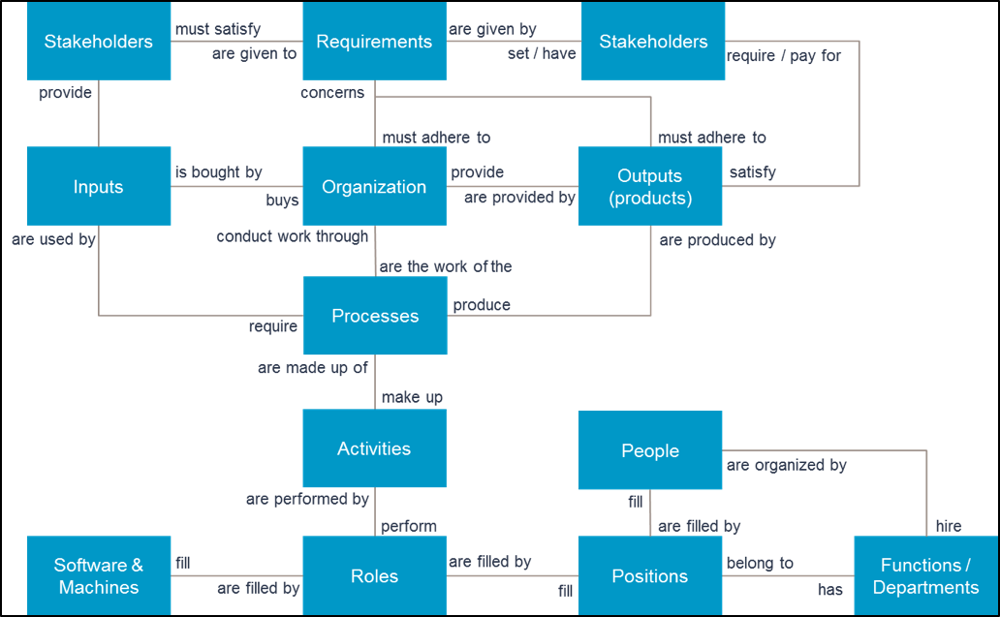
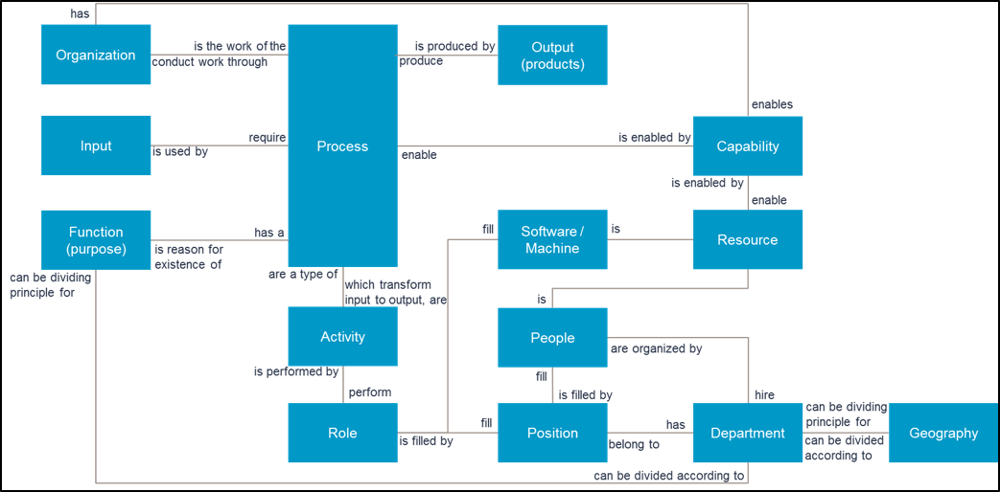
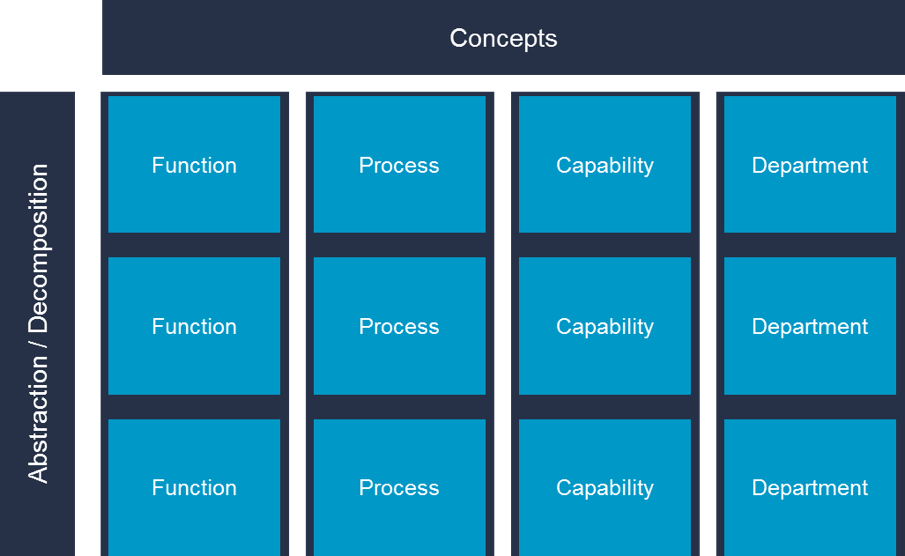

## Clarification of central concepts
Working with Enterprise and Business Architecture involves defining and relating concepts to each other. This must be done on a “platform” or “dictionary” level (called conceptual metamodel), before one can go ahead and model the actual architecture. An analogy is that the engineers and building architect must agree on what words mean before they start creating the blueprints.

Concepts: Wikipedia: “Concepts are something conceived in the mind, and an abstract idea representing the fundamental characteristics of what it represents. Concepts arise as abstractions or generalizations from experience or the result of a transformation of existing ideas. In the simplest terms, a concept is a name or label that regards or treats an abstraction as if it had concrete or material existence, such as a person, a place, or a thing. It may represent a natural object that exists in the real world like a tree, an animal, a stone, etc. It may also name an artificial (man-made) object like a chair, computer, house, etc. Concepts are created (named) to describe, explain and capture reality as it is known and understood.”

Core concepts must be named / labeled and explained in the conceptual metamodel. For example, what is meant by a function? We have this label / name called function, but it must be further clarified what it is, what attributes and relations it has to other concepts.

Example: Conceptual Metamodel for Process oriented Business Architecture

Each concept can be defined further textually (dictionaries) and in separate models that detail important aspects of that particular concept.

**Much discussed concepts: Process, functions, capabilities, departments**
There exist a lot of discussion and confusion about the concepts process, capability, function and department. A conceptual metamodel can help to clarify the discussion.

**First, an activity** is a higher conceptual class of action than process. Activity simply is doing something, action.

**A process** on the other hand is any activity that transform input to output that has value for someone. Process specifically structures activities according to sequential and parallel value creation.

**A function is** the purpose of something. (E.g. the function of the veins is to carry blood to the heart. Cambridge dictionary). One of the things purpose is used for is to group things, for example activities or people. However, the concept of function offers no internal structure among the elements. To the extent the purpose of something is to transform input into output of value for someone, the concept of process must be used to answer “how”. If the function is something else, then the concept of process is not involved in answering “how”. In both programming and business there is extensive and different misuse of these concepts. In programming, function is often defined similarly as process. In business, function is often thought of being the same as department.

**Departments are** divisions of an organization by which people and resources are grouped and managed. Departmentalization may have different dividing principles, some of which are functional, geographical, product, project or process. Departments can be created and named by their functions (purpose). In such a case, the function is usually at a very abstract level; e.g. the function if this department is “Accounting”.

**Capability** is simply the state of being capable of something. Such a state becomes true by having a recipe of how to do something (process) and having the resources to perform the process. Resources includes people, money, machines, time, etc.

**Abstraction levels**  are a major reason for confusion. All concepts mentioned can be used from very abstract to very concrete levels. For example, a function at a very high level might be that the function of our company is to provide customers with electric cars. At a very concrete level a person might have the function of mounting steering wheels. A process at very high level might be “Provide electric car”, and a very concrete process might be “Mount steering wheel”. Do we have the capability to mount a steering wheel? Well, at least we have a process for it, and a person to perform it, but do we have the other materials? The point is that all these concepts are discrete concepts, and not more or less abstract in relation to each other. Put another way, capability cannot be broken down into functions, which cannot be broken down into processes. Their relations are not of decomposition. They can however be decomposed into more details of the same concept.

