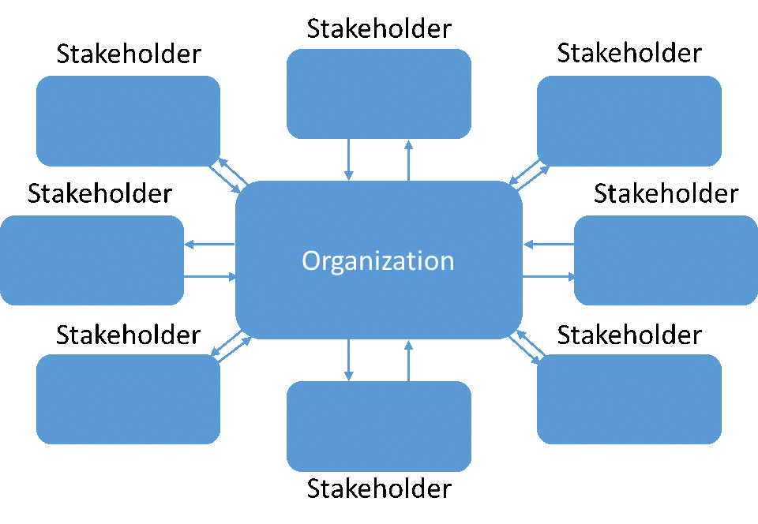
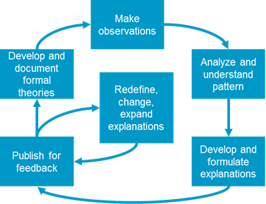

# What is Business Architecture?

Business Architecture consists of principles, methods and tools for the design and management of how the organization satisfies relevant stakeholders. In many ways, it can be seen as a concretization of the more tangible aspects of management. Compared to traditional building architecture that is often relatively static once built, Business Architecture has more focus on aspects of management and change as organizations are always evolving.

The purpose of Business Architecture is understanding, improving and shaping our work to satisfy stakeholders. The Architecture is created from making our business insight explicit in the form of models that describe our understanding. These models then create a platform for shared understanding, transparency and thus exponentially increased insights-generation, which again shape both real life and updated models. This platform enables better implementation and execution of strategy, as well as better strategic decision making from better information. Decisions influence structure, and structure influence decisions.

The main concepts in a Business Architecture are, but not limited to, stakeholders, inputs, outputs, processes, departments, positions, people, goals and objectives. Organizations must satisfy stakeholders to survive and thrive. To do this, they must provide outputs that are of value to the stakeholders, and they must handle inputs received from stakeholders.

All outputs are created from processes, and all inputs are handled by processes. Processes are our work. In processes, the work-activities are performed by roles. Roles are filled by positions, which in turn are filled by people. Positions and people belong to departments. Goals and objectives specify targets for different aspects of our relationships with stakeholders, input-output transactions, and process performance.

The perhaps most central concept within Business Architecture is Process Architecture. This is because work-activities are what produces outputs of value. All other elements of an organization exist to support, steer or in some way or another influence work. Business processes therefore become the red thread of alignment through the complex cloud that is the modern organization. Why do we have people? To perform work. Why do we have a rules, goals and objectives? To steer work. Why do we have IT-applications, machines or facilities? To support work and enable work. The study of processes is the study of how we work to achieve outputs and outcomes of value. If we want to align all the aspects of our organization, we must first understand our processes and their output.

