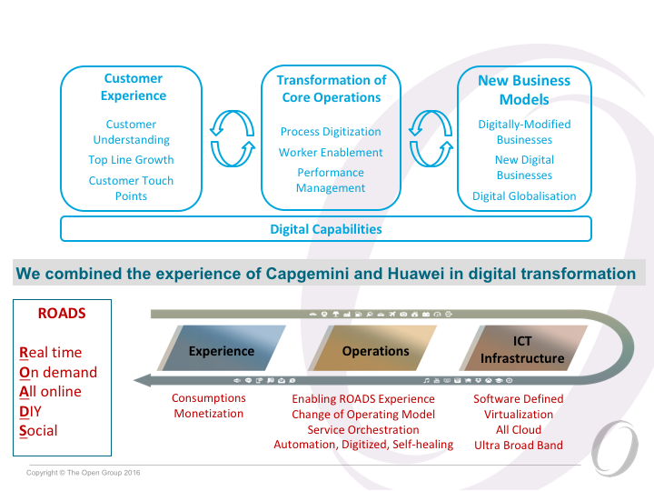
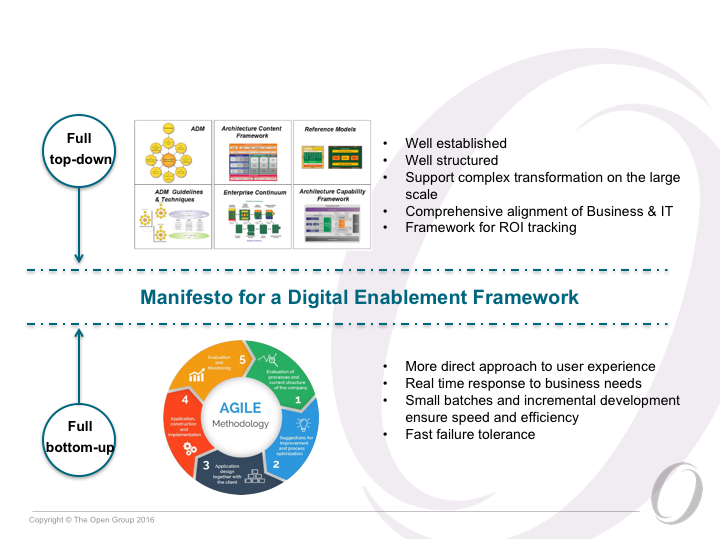
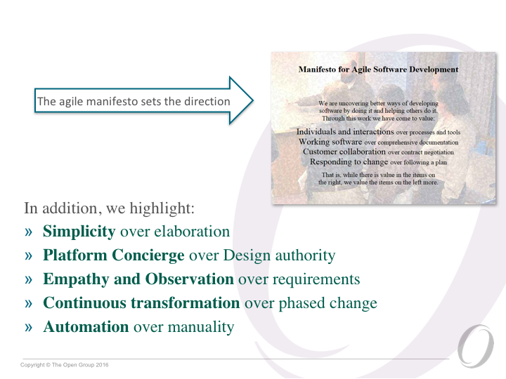
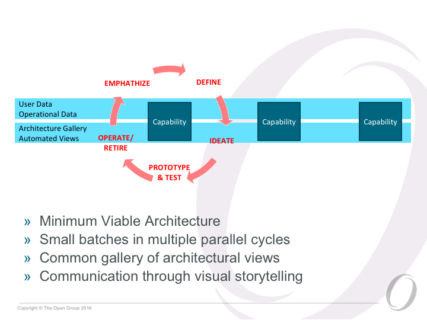
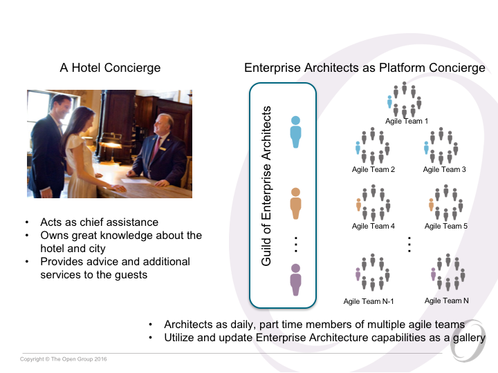
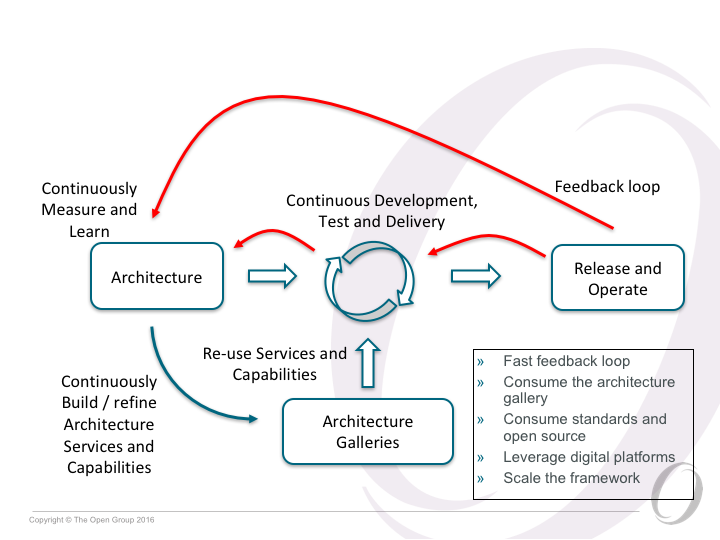
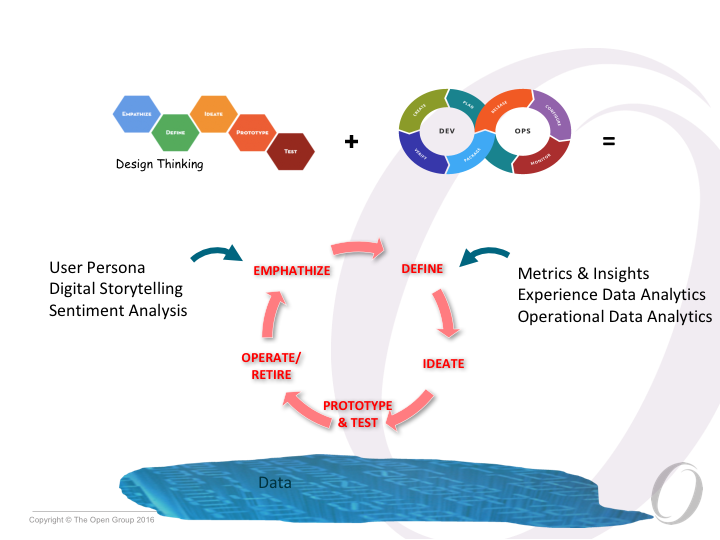
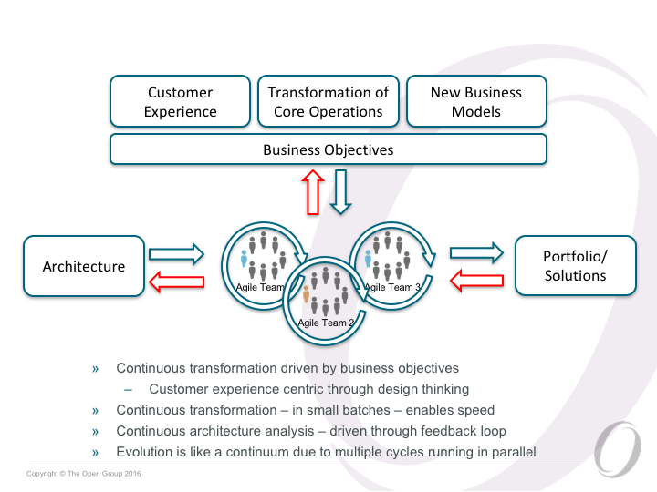
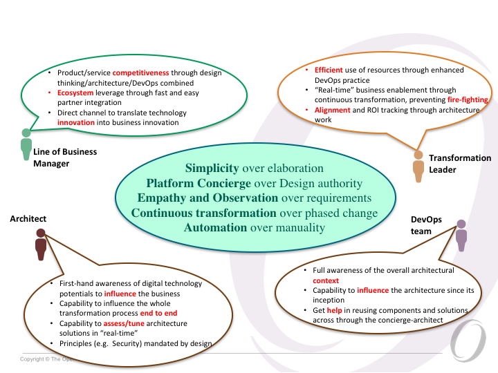

# Manifesto for digital (architected) enablement

## Digital technologies drive business transformation

## We are looking for a balance in enterprise transformation dynamics

## Manifesto for a Digital Enablement Framework

## Simplicity over elaborate architectures

## Platform Concierge over Design authority

## Automation over manual architecting

## Empathy and observation over requirements

## Continuous transformation over phased change

## We have an opportunity to deliver enhanced value

## Call to action
Our team is going to do further work that we will share, developing the ideas of this Manifesto
Based on best practices experienced in helping our clients’ digital transformation journeys
Based on your comments/feedbacks/contributions or even criticism that we will receive

A Manifesto whitepaper, working draft is hosted at:
	https://openroadscommunity.com/resources/manifesto-digital-enablement-framework
You can also comment on:
	www.linkedin.com/hp/update/6196609305043668992

## To summarize

- Todays’ business is very different than it was a decade ago, and nowadays focus is on customer experience and rapid value delivery through digital technologies/practices
- The existing frameworks and practices still offer value
- We have an opportunity to augment it even further by introducing agile principles based on simplification, collaboration, automation, feedback-driven incremental evolution
- Capgemini and Huawei are combining respective experiences to investigate this idea of a new - Digital Enablement Framework, starting from its foundational principles
- We would like to share this working draft and initiate an open discussion
