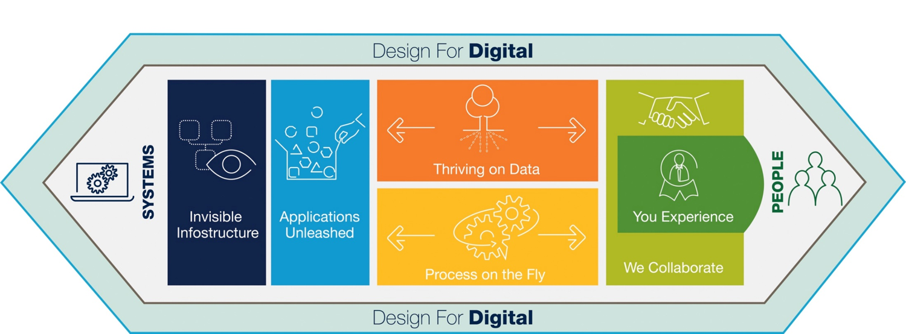

# Introduction to TechnoVision

As we consider the continued and rapid pace of business technology disruption and innovation across global markets in 2016, we have fewer and fewer points of stability, predictability, or maturity upon which to frame — let alone address — the opportunities and challenges presented to our businesses. More the rule than the exception, the way we think about business technology introductions and impacts — and the way we respond to them — requires a regular and fundamental rearchitecting and repositioning to accommodate the new.

TechnoVision, is one such exception. Designed and developed with a keen appreciation for the fundamentals and core domains of today’s business technology landscape, we’ve seen this body of
intellectual capital and actionable references align and respond well to the continued pace of emerging technologies, and the business disruptions and innovations they enable. The TechnoVision seven-element framework and its building blocks — led by the Design for Digital principles — have been applied successfully and continually to industry segments, a diversity of
enterprises, and countless process domains and technology environments.
Hence, TechnoVision is proven in the massive and continuously disruptive
markets we face.

Move ahead boldly and quickly in your technology journey with TechnoVision
2016. You have the benefit of proven intellectual capital aligned to the
business technology challenges and opportunities that enterprises face
today. Its value remains in its insights, flexible application, maturity, and
diverse audience engagement. It’s fun to read and an infinite source of
inspiration for dialog. We believe by focusing on and framing the most
important questions and responses to becoming a Digital Enterprise,
TechnoVision 2016 is a crucial asset for business technology leadership
and strategies.

Enjoy and we remain eager for your feedback. [Read more about TechnoVision...](https://www.capgemini.com/resource-file-access/resource/pdf/technovision_2016.pdf)

